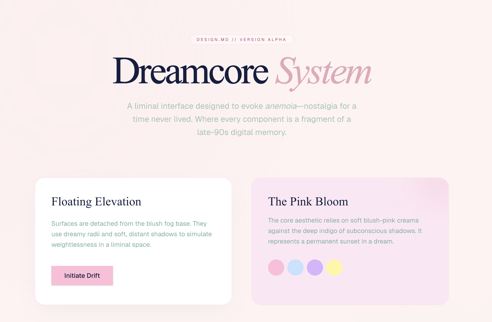

# Dreamcore Design System (DESIGN.md)



A surreal, emotional, and nostalgic design system designed for AI coding agents. It captures the essence of liminal spaces and late-90s digital memories through hazy pastels, floating elevations, and poetic rationale.

This repository provides a fully spec-compliant `DESIGN.md` file that you can drop into any project to guide AI tools (like Cursor, Claude Code, or Gemini CLI) in generating UI with a "Dreamcore" aesthetic.

## 🌸 The Aesthetic: Pink Bloom & Anemoia
Dreamcore relies on a warm, blush-pink canvas (`#fef2f2`) contrasting with deep indigo "subconscious" shadows (`#151e3f`). It uses generous "liminal" spacing to create a sense of quietude and transition.

## 🚀 Usage

You can instantly add this design system to your project using the `designmd.sh` registry:

```bash
npx designmd.sh add masa-sumimoto/dreamcore-design-md
```

Or, manually copy the `DESIGN.md` file into the root of your project.

### Instructing your AI
Once installed, simply tell your AI agent:
> "Create a new dashboard layout. Strictly follow the tokens and rationale defined in DESIGN.md."

## 📜 Spec Compliance
This `DESIGN.md` is strictly aligned with the [Google Labs DESIGN.md Specification](https://github.com/google-labs-code/design.md).
- Version: `alpha`
- Zero Linter Warnings (`npx designmd.sh validate`)

## 👨‍🎨 Author
Designed and engineered by **Masaaki Sumimoto**.
